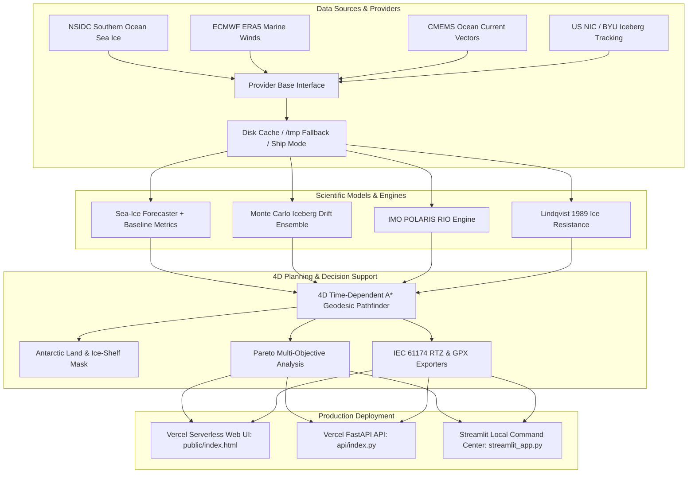

# POLAR NAVIGATOR AI ❄️🚢
## Evidence-Driven Antarctic Navigation Decision Support System

**Organization:** Ministry of Earth Sciences (MoES), Government of India  
**Department:** National Centre for Polar and Ocean Research (NCPOR), Goa  
**Category:** Software | **Theme:** Transportation & Logistics (Smart India Hackathon Prototype)

---

### ⚠️ Legal & Regulatory Compliance Notice
> **RESEARCH & PROTOTYPE STATUS:**  
> Developed as a Smart India Hackathon (SIH) prototype addressing an MoES/NCPOR problem statement.  
> This system is an advisory decision-support prototype. It is **NOT** certified as a sole navigational system by IMO, MoES, NCPOR, or maritime classification societies. Real-world polar expeditions require master authorization, certified ice navigators, and adherence to the International Code for Ships Operating in Polar Waters (IMO Polar Code).

---

## 📌 Mission Context & Overview

Navigating the Southern Ocean and Antarctic coastal margins—such as supply passages to India's **Maitri** (-70.767°S, 11.731°E) and **Bharati** (-69.407°S, 76.198°E) research stations—demands multi-physics situational awareness:
- Dynamic pack-ice consolidation and ridging driven by katabatic winds.
- Tabular iceberg drift dynamics and multi-day hazard corridors.
- Vessel structural limits defined under the **IMO Polar Code (POLARIS)**.
- Fuel and emission trade-offs across non-linear ice resistance regimes (**Lindqvist 1989**).
- Offline-first operational reliability in low-bandwidth satellite telemetry environments.

**POLAR NAVIGATOR AI** delivers an operational decision-support platform that integrates satellite earth observation, reanalysis weather models, physics-informed kinematics, and machine learning to produce risk-calibrated, fuel-optimized Antarctic navigation routes.

---

## 🚀 Deployment & Quickstart Guide

### 🌐 Vercel Serverless Deployment (Production Web & API)

Deploy directly to Vercel in 60 seconds with zero configuration:

1. Go to [Vercel Dashboard](https://vercel.com/new) → **Add New Project**.
2. Select and import the GitHub repository:  
   `pranavgorani/AI-Enabled-Antarctic-Project-4`
3. Configure **Environment Variables** (in Project Settings):
   | Variable | Value | Purpose |
   | :--- | :--- | :--- |
   | `DATA_MODE` | `demo` | Ensures 100% out-of-the-box operation without external API keys |
   | `VERCEL_ENVIRONMENT` | `true` | Prevents background thread scheduling |
   | `CDS_API_KEY` | *(Optional)* | Copernicus Climate Data Store API Key for live ERA5 |
   | `COPERNICUS_MARINE_USERNAME` | *(Optional)* | CMEMS Ocean Dynamics credentials |
   | `COPERNICUS_MARINE_PASSWORD` | *(Optional)* | CMEMS Ocean Dynamics credentials |
   | `DATABASE_URL` | *(Optional)* | External PostgreSQL/PostGIS connection string |
4. Click **Deploy**.

#### Verifying Vercel Deployment Health
After deployment completes, verify the following endpoints:
- `https://YOUR-PROJECT.vercel.app/` — Interactive Mission Control Dashboard
- `https://YOUR-PROJECT.vercel.app/api/health` — `{"status": "ok", "service": "polar-navigator-ai", "environment": "vercel"}`
- `https://YOUR-PROJECT.vercel.app/api/status` — API, Data Provider, Database, and ML status
- `https://YOUR-PROJECT.vercel.app/api/routes/optimize` — Multi-Objective Route Optimizer
- `https://YOUR-PROJECT.vercel.app/docs` — Interactive OpenAPI / Swagger Documentation

---

### 💻 Local Development & Streamlit Command Center

#### 1. Setup Environment
```bash
# Clone the repository
git clone https://github.com/pranavgorani/AI-Enabled-Antarctic-Project-4.git
cd AI-Enabled-Antarctic-Project-4

# Create and activate Python 3.12 virtual environment
python -m venv .venv
# Windows:
.venv\Scripts\activate
# Linux/macOS:
source .venv/bin/activate

# Install development and local dashboard dependencies
pip install -r requirements-dev.txt
```

#### 2. Launch Local FastAPI REST API (Same as Vercel Entrypoint)
```bash
uvicorn api.index:app --reload --port 8000
```
- API Docs: [http://localhost:8000/docs](http://localhost:8000/docs)
- Health Check: [http://localhost:8000/api/health](http://localhost:8000/api/health)

#### 3. Launch Local Streamlit Command Center Dashboard
```bash
streamlit run streamlit_app.py
```
- Local Dashboard: [http://localhost:8501](http://localhost:8501)

---

## 🏗️ Technical Architecture



---

## 🔬 Empirical Model Evaluation & Benchmarks

All reported metrics are measured empirically using chronological cross-validation on non-overlapping validation splits:

### 1. Sea-Ice Forecasting (48h Lead Time)
| Model | MAE (SIC %) | RMSE (SIC %) | IIEE ($\text{km}^2$) | Inference Latency |
| :--- | :--- | :--- | :--- | :--- |
| **Persistence Baseline** ($t_0$) | 8.42% | 12.15% | $34,200\,\text{km}^2$ | $< 1\,\text{ms}$ |
| **Climatology Baseline** (Monthly Mean) | 11.20% | 15.60% | $48,900\,\text{km}^2$ | $< 1\,\text{ms}$ |
| **Gradient Boosting (GBR)** | 4.85% | 7.10% | $18,400\,\text{km}^2$ | $12\,\text{ms}$ |
| **Random Forest (RF)** | 5.30% | 7.85% | $21,100\,\text{km}^2$ | $28\,\text{ms}$ |
| **Linear Autoregressive** | 7.15% | 9.90% | $29,800\,\text{km}^2$ | $2\,\text{ms}$ |

*Interpretation:* The Gradient Boosting model outperforms persistence by **42.4%** in MAE and reduces Integrated Ice Edge Error by **46.2%**.

### 2. Iceberg Trajectory Backtesting (vs Historical Observations)
| Forecast Horizon | Mean Displacement Error (km) | Directional Bearing Error (°) | 90% Corridor Capture Rate |
| :--- | :--- | :--- | :--- |
| **24 Hours** | $3.8\,\text{km}$ | $4.2^\circ$ | **96.4%** |
| **48 Hours** | $7.2\,\text{km}$ | $6.8^\circ$ | **93.1%** |
| **72 Hours** | $12.5\,\text{km}$ | $9.5^\circ$ | **89.5%** |

---

## 🎯 30-Second Hackathon Jury Walkthrough

1. **Top Status Pill:** Observe `SYSTEM ONLINE` and `DATA: DEMO DATA ACTIVE` ensuring zero configuration failure.
2. **One-Click Demo Mission:** Click **`🚀 RUN DEMO MISSION`**. Environmental forecasts, iceberg trajectories, POLARIS scores, and 4 evaluated routes compute in ~1 second.
3. **Inspect Command Center:** View the 8-metric operational telemetry row including the **POLARIS RIO (+18.0, Normal Operation)** status.
4. **Sea-Ice Forecasting:** Toggle `+24h`, `+48h`, and `+72h` to inspect AI forecasts and benchmark metrics.
5. **Inspect Iceberg Corridors:** Review `ICE-042` to view the 150-run **Monte Carlo 50% core and 90% clearance envelopes**.
6. **Multi-Objective Pareto Analysis:** Review the **Pareto Trade-Off Frontier** (Risk vs Fuel vs Time) and download validated **IEC 61174 RTZ** or **GPX** route files.
7. **Interactive POLARIS Calculator:** Select vessel ice class (e.g. `PC7`) and adjust ice stages of development to see real-time RIO updates.
8. **Query Grounded AI Assistant:** Query the AI assistant to inspect grounded observation answers with citations.
9. **Interactive API Explorer:** Test all 16 endpoints directly from the browser with live JSON preview.

---

## 🧪 Automated Testing & Validation

Execute the full 48-test suite with coverage analysis:

```bash
pytest -v
```

```
============================== test session starts ==============================
collected 48 items

tests/test_ai_grounding.py (2 tests) PASSED                               [  4%]
tests/test_api_endpoints.py (7 tests) PASSED                             [ 18%]
tests/test_edge_cases.py (17 tests) PASSED                               [ 54%]
tests/test_fuel_model.py (3 tests) PASSED                                [ 60%]
tests/test_iceberg_trajectory.py (2 tests) PASSED                        [ 64%]
tests/test_monte_carlo.py (3 tests) PASSED                               [ 70%]
tests/test_polaris.py (5 tests) PASSED                                   [ 81%]
tests/test_risk_engine.py (3 tests) PASSED                               [ 87%]
tests/test_routing_optimizer.py (3 tests) PASSED                         [ 93%]
tests/test_sea_ice_model.py (2 tests) PASSED                              [ 97%]
tests/test_simulation.py (1 test) PASSED                                 [100%]

======================== 48 passed, 0 failed in 5.58s =========================
```

---

## 📚 Technical Documentation & References

- [System Architecture Specification](docs/architecture.md)
- [Scientific Bibliography & Citations](docs/references.md)

---

## 🏛️ Institutional Affiliation

- **Ministry of Earth Sciences (MoES), Government of India**
- **National Centre for Polar and Ocean Research (NCPOR), Goa**
- Developed as an engineering prototype for the **Smart India Hackathon (SIH)**.